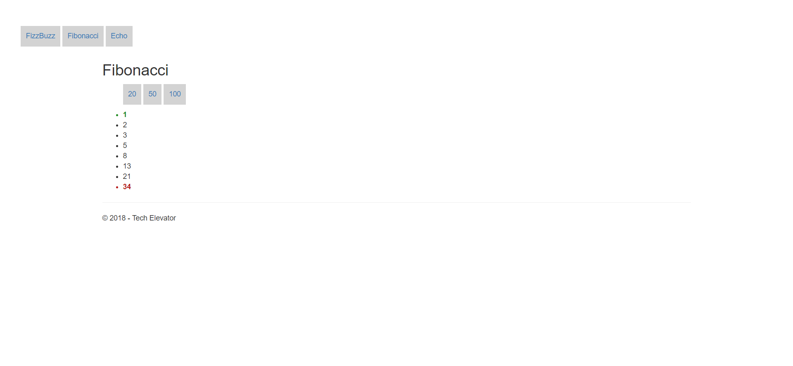
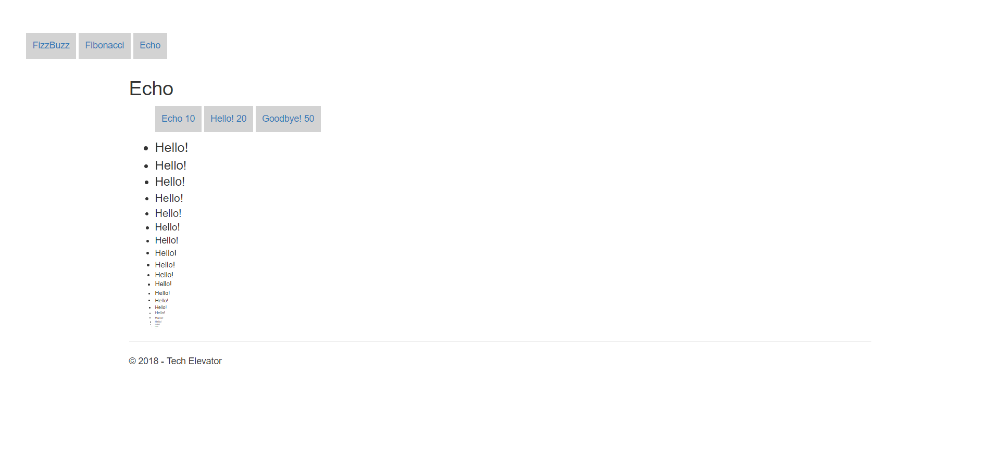

# MVC Views Part 1 Exercises

## 1. Fizzbuzz

### Part 1

Create a view called `FizzBuzz` that displays the first N numbers of FizzBuzz. The format for the url will be: `http://localhost:xxxxx/home/fizzbuzz?number=20`. The number to go up to is available via the `ViewData["number"]` property.

- if the number is divisible by 3, show "Fizz!" instead
				
- if the number is divisible by 5, show "Buzz!" instead
				
- if the number is divisible by both 3 and 5, show "FizzBuzz!"

### Part 2

Add navigation elements to the top of the view that allow the user to click on a pre-set number to see FizzBuzz.

### Part 3

All `Fizz!` words should be styled `blue`.

All `Buzz!` words should be styled `red`.

All `FizzBuzz!` words should be twice the size of the page font and `#228b22`.

				
## 2. Fibonacci

### Part 1

Create a view called `Fibonacci` that displays the numbers of the Fibonacci sequence up to N. The format for the url will be: `http://localhost:xxxxx/home/fibonacci?max=50`. The number to go up to is available view the `ViewData["max"]` property.

### Part 2

Add navigation elements to the top of the view that allow the user to click on a pre-set number to see Fibonacci.

### Part 3

The first number in the fibonacci sequenece should be `#228b22`.

The last number in the fibonacci sequenece should be `#b71b1b`.

## 3. Echo

### Part 1

Create a view called `Echo` that displays a repeated word N number of times with decreasing font until it is no longer visible. The format for the url will be: `http://localhost:xxxxx/home/echo?word=hello&count=20`. The word and number of times to display are available via the `ViewData["word"]` and `ViewData["count"]` property.

The  font size of the first list item should be equal to `count`. The font size of each subsequent list item should be decreased by 1.

### Part 2

Add naviation elements to the top of the view that allow the user to click on a pre-set word and number to see it on the screen.

